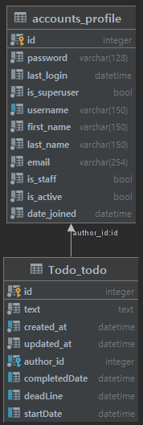

# TO DO LIST

## Purpose Of Project

edit . 2021-08-25

---

- Due to Study `React` about `reducer` `context` ... etc
- Also To Deploy & use this project myself

## Project Introduce

edit . 2021-08-25

---

- To remind me what to do & how much time I got
- To show history about what I have done. 

## Service Address

edit . 2021-08-25

---

### Front End

https://adoring-sammet-a0d202.netlify.app

### Back End

https://cwadven4.pythonanywhere.com

## Project Duration

edit . 2021-08-25

---

2021-08-24 ~

## Technologies Used

edit . 2021-08-25

---

#### Frontend Stack
 

#### Backend Stack
 

## Deploy

edit . 2021-08-25

---

#### Frontend


#### Backend

Pythonanywhere

## Developer Information

edit . 2021-08-25

---

#### Frontend Developer

##### 👨‍🦱 이창우 (Lee Chang Woo)

- Github : https://github.com/cwadven

#### Backend Developer

##### 👨‍🦱 이창우 (Lee Chang Woo)

- Github : https://github.com/cwadven


## Project Structure

edit . 2021-08-25

---

#### Backend

```
Project Root
├── 📂 config
│    ├── 📜 settings.py
│    ├── 📜 asgi.py
│    ├── 📜 urls.py
│    └── 📜 wsgi.py
│
├── 📂 accounts
│    ├── 📂 migrations                               
│    ├── 📜 adapter.py                               
│    ├── 📜 admin.py                                
│    ├── 📜 app.py
│    ├── 📜 serializer.py
│    ├── 📜 tests.py
│    ├── 📜 urls.py
│    ├── 📜 validators.py
│    ├── 📜 views.py
│    └── 📜 modles.py                                     
│
├── 📂 App Name
│    ├── 📂 migrations                                     
│    ├── 📜 admin.py                                  
│    ├── 📜 app.py
│    ├── 📜 serializer.py
│    ├── 📜 tests.py
│    ├── 📜 urls.py
│    ├── 📜 views.py
│    └── 📜 modles.py  
│  
├── 📂 App Name
│    ├── 📂 migrations                                     
│    ├── 📜 admin.py                                  
│    ├── 📜 app.py
│    ├── 📜 serializer.py
│    └ .....
│       
│
├── 🗑 .gitignore                                        # gitignore
├── 🗑 requirements.txt                                  # requirements.txt
└── 📋 README.md                                        # Readme
```

## DB Structure

edit . 2021-08-25

---

### Very Simple



## Frontend Info Link

---

https://github.com/cwadven/React-Todo-List